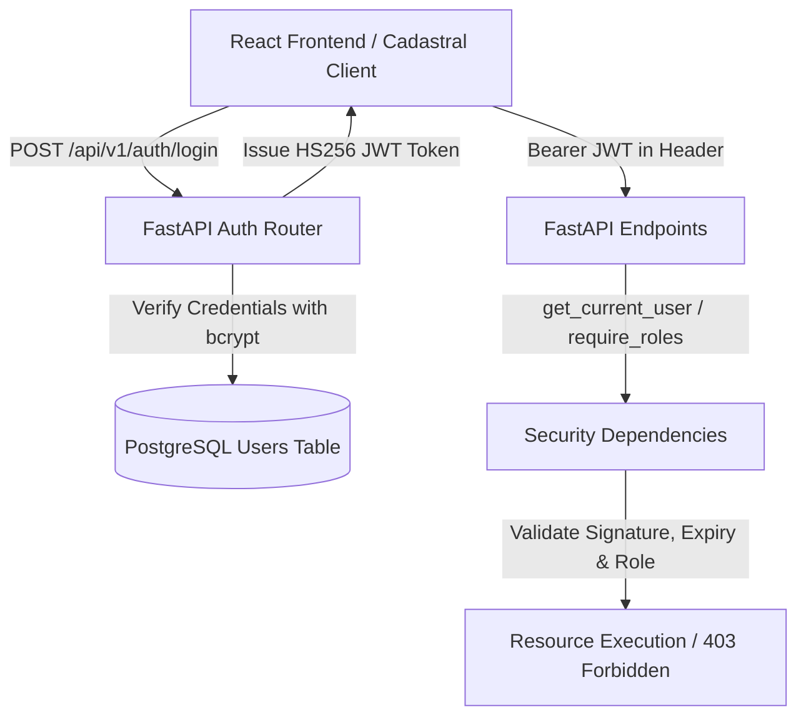

# BhuVistaar 3D — Authentication & Role-Based Access Control (RBAC)

**SIH Problem Statement 26011:** 3D ULPIN Generation and Vertical Property Mapping System  
**Module:** Task 14 — Authentication, JWT & Role-Based Access Control

---

## 1. Overview & Architecture

BhuVistaar 3D implements an institutional, production-grade authentication and authorization subsystem built with **FastAPI**, **PostgreSQL / SQLAlchemy 2.0**, **Alembic**, and **React 19 / Vite**.

The security architecture provides cryptographically validated authentication via stateless JSON Web Tokens (JWT) using `HS256`, paired with salted password hashing using `bcrypt`.



---

## 2. Institutional Roles

The application strictly distinguishes between three access tiers:

| Role | Access Scope | Interface View | Description |
| :--- | :--- | :--- | :--- |
| **`CITIZEN`** | Public cadastral inspection, 3D ULPIN generation, unit spatial queries, floor-peeling | Existing BhuVistaar 3D Cadastral Interface | General public and property right-holders. Public registration creates this role exclusively. |
| **`OFFICIAL`** | Cadastral verification, future blueprint/CAD ingestion, volumetric clearance | Official Portal Placeholder | Municipal surveyors, town planners, and cadastral officers. |
| **`ADMIN`** | System configuration, database governance, role oversight, full audit access | Admin Portal Placeholder | System administrators and Chief Cadastral Officers. |

> **Official & Admin Account Safety:**  
> A public registration request can **NEVER** elevate itself to `OFFICIAL` or `ADMIN`. The `POST /api/v1/auth/register` endpoint unconditionally assigns `role = CITIZEN`. Official and Administrator accounts can only be provisioned through secure database seeding or authorized CLI administrative tooling.

---

## 3. Authentication & RBAC APIs

### Endpoints Summary

| Method | Endpoint | Access | Description |
| :--- | :--- | :--- | :--- |
| `POST` | `/api/v1/auth/register` | Public | Registers a citizen user. Unconditionally forces `CITIZEN` role. |
| `POST` | `/api/v1/auth/login` | Public | Validates credentials and returns signed JWT access token and user metadata. |
| `GET` | `/api/v1/auth/me` | Authenticated | Returns profile of the current authenticated user. |
| `POST` | `/api/v1/auth/logout` | Authenticated | Acknowledges client-side token discard (stateless JWT). |
| `GET` | `/api/v1/auth/official-test` | `OFFICIAL`, `ADMIN` | Protected test endpoint. Citizens receive HTTP 403 Forbidden. |
| `GET` | `/api/v1/auth/admin-test` | `ADMIN` | Protected test endpoint. Non-admins receive HTTP 403 Forbidden. |

### JWT Specification

* **Algorithm:** `HS256`
* **Config Keys:** `JWT_SECRET_KEY`, `JWT_ALGORITHM`, `ACCESS_TOKEN_EXPIRE_MINUTES`
* **Token Payload Claims:**
  * `sub`: Subject identifier (User UUID)
  * `email`: User authoritative email address
  * `role`: User institutional role (`CITIZEN`, `OFFICIAL`, `ADMIN`)
  * `iat`: Token issue timestamp (UTC)
  * `exp`: Token expiration timestamp (UTC)

---

## 4. Seeding & User Management CLI

For development and demonstration purposes, a dedicated CLI management utility is provided at `scripts/seed_users.py`.

### Default Demo Accounts

```bash
# From repository root:
python scripts/seed_users.py
```

Pre-seeded accounts:

1. **Citizen:**
   - **Email:** `citizen@bhuvistaar.gov.in`
   - **Password:** `Citizen@2026`
   - **Role:** `CITIZEN`
2. **Official:**
   - **Email:** `official@bhuvistaar.gov.in`
   - **Password:** `Official@2026`
   - **Role:** `OFFICIAL`
3. **Administrator:**
   - **Email:** `admin@bhuvistaar.gov.in`
   - **Password:** `Admin@2026`
   - **Role:** `ADMIN`

### Custom Account Creation via CLI

```bash
python scripts/seed_users.py --name "Custom Official" --email custom@gov.in --password "SecurePass@2026" --role OFFICIAL
```

---

## 5. How to Run Backend & Frontend

### Prerequisites

Ensure the PostgreSQL/PostGIS Docker container is running:
```bash
docker compose up -d
```

### Start Backend

```powershell
cd backend
.\.venv\Scripts\python.exe -m uvicorn app.main:app --host 127.0.0.1 --port 8000
```
* API Server: [http://127.0.0.1:8000](http://127.0.0.1:8000)
* Swagger UI: [http://127.0.0.1:8000/docs](http://127.0.0.1:8000/docs)

### Start Frontend

```powershell
cd frontend
npm run dev
```
* Web Application: [http://localhost:5173](http://localhost:5173)

---

## 6. Verification & Test Commands

### Backend Test Suite (Pytest)

Run all 91 unit and integration tests (including 15 dedicated authentication tests):
```powershell
cd backend
.\.venv\Scripts\python.exe -m pytest
```

Run authentication tests specifically:
```powershell
cd backend
.\.venv\Scripts\python.exe -m pytest tests/test_auth.py -v
```

### Frontend Lint & Production Build

```powershell
cd frontend
npm run lint
npm run build
```

---

## 7. Scope Boundaries (Task 14 vs. Task 15)

* **Task 14 (Current):** Focuses solely on user authentication, credential encryption, JWT token management, role-based access dependencies, and role-based frontend routing.
* **Task 15 (Upcoming):** Will introduce the comprehensive Official Dashboard, DXF/CAD architectural blueprint upload pipeline, and automated 3D volumetric extrusion tools.
